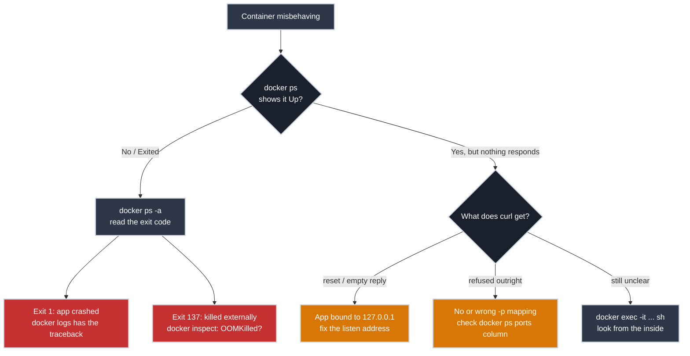

# Debugging a Container That Won't Behave

!!! tip "Part of Day One: Containerizing a Single App"
    Third article in [Containerizing a Single App](../overview.md#containerizing-a-single-app). Assumes you've [built and run](build_and_run.md) a container already.

Your container fails in one of two failure modes, and they call for different diagnosis. Either it exits the moment it starts (`docker ps` shows nothing, or shows `Exited`), or it stays up and shows `Running`, and nothing you send it gets a response. The first is a crash. The second is quieter and, the first time you hit it, more confusing.



## Failure Mode One: The Container Exits Immediately

Start with the obvious check: does `docker ps` even show the container running?

``` bash title="It's Not There"
docker ps
# CONTAINER ID   IMAGE       COMMAND   STATUS   PORTS   NAMES
# (nothing)
```

An empty list doesn't mean the container never existed. `docker ps` only shows what's *currently running*, and for a container that's supposed to stay up, not being there is itself the diagnosis: it started and then died. The next command tells you what it left behind:

✅ **Safe (Read-Only):**

``` bash title="Check Containers Including Stopped Ones"
docker ps -a
# CONTAINER ID   IMAGE        COMMAND           STATUS                      NAMES
# 7f8e9d0c1b2a   my-api:1.0   "python app.py"   Exited (1) 4 seconds ago    my-api-dev
```

The exit code in parentheses is your first clue: `Exited (1)` means the process ran and errored out; `Exited (137)` usually means something outside the container killed it (often an out-of-memory kill). For the 137 case, `docker inspect` can confirm the kill was memory-related without any guesswork:

``` bash title="Confirm an Out-of-Memory Kill"
docker inspect -f '{{.State.ExitCode}} OOMKilled={{.State.OOMKilled}}' my-api-dev
# 137 OOMKilled=true
```

For everything else, the logs have the actual story:

``` bash title="Read the Crash"
docker logs my-api-dev
# Traceback (most recent call last):
#   File "app.py", line 12, in <module>
#     DATABASE_URL = os.environ["DATABASE_URL"]
# KeyError: 'DATABASE_URL'
```

That's the most common Day One crash, and it's not a Docker problem at all — it's [the environment variable you forgot to pass in](build_and_run.md#passing-in-what-the-image-shouldnt-contain). The container built fine, the image is fine, and the app crashes the instant it runs because a value it expects to find in its environment isn't there. (`docker inspect -f '{{.Config.Env}}' my-api-dev` shows exactly which variables the container was started with, if you want to check without restarting anything.)

The second most common: a permission error, because [the Dockerfile switched to a non-root user](first_dockerfile.md) and that user doesn't own a directory the app tries to write to.

``` bash title="A Permission Crash"
docker logs my-api-dev
# PermissionError: [Errno 13] Permission denied: '/app/cache'
```

The fix belongs in the Dockerfile, not the running container: either create that directory and hand it to `appuser` explicitly before the `USER` line switches to it, or point the app at a location it's actually allowed to write to.

That's the first failure mode — the container never made it to `Up` at all, and the logs told you why almost every time. The second one is quieter, and the first time you hit it, more confusing: nothing in `docker ps` looks wrong.

## Failure Mode Two: It Runs, But Nothing Responds

``` bash title="It Looks Fine"
docker ps
# CONTAINER ID   IMAGE        STATUS         PORTS                    NAMES
# 7f8e9d0c1b2a   my-api:1.0   Up 2 minutes   0.0.0.0:8000->8000/tcp   my-api-dev
```

Status says `Up`. The port mapping looks right. And `curl http://localhost:8000` fails anyway — the connection is reset, refused, or comes back empty.

The single most common cause: **the app is listening on `127.0.0.1` instead of `0.0.0.0`.** Inside a container, `127.0.0.1` means "only reachable from within this exact container's own network namespace." Port publishing (`-p 8000:8000`) forwards traffic to the container's network interface, but if the app only bound to its internal loopback address, that forwarded traffic arrives at an interface nothing is listening on and gets rejected. Locally, on your laptop, this distinction never came up, because `127.0.0.1` and "reachable from outside" happened to be the same thing.

The fix is in your application's code or start command, not Docker: whatever configures the app's listen address needs to be `0.0.0.0`, not `localhost` or `127.0.0.1`. Essentials will cover why this distinction exists when it gets to Docker networking; for Day One, it's enough to know it's the first thing to check.

That covers the two failure modes and their usual causes. Every so often, though, neither `docker logs` nor the obvious suspects tell you enough — the crash message is generic, or the app claims to be listening correctly and you still can't reach it. When explanations from the outside run out, the next move is the same either way: stop guessing and look from the inside.

## Getting a Shell Inside a Running Container

Get inside the container and look around directly, the same way you'd SSH into a misbehaving server:

⚠️ **Caution (Modifies Nothing, But Runs Commands Inside the Container):**

``` bash title="Open a Shell Inside the Container"
docker exec -it my-api-dev sh
# / #
```

`-it` keeps the session interactive; `sh` is the safest shell to assume exists, since not every base image ships `bash`. From inside, you're looking at exactly what the process sees:

``` bash title="Check What the App Sees"
env | grep DATABASE_URL
# confirm the variable actually made it in

ls -la /app/cache
# confirm the directory exists and check who owns it

ps aux
# confirm the app process is actually running, not silently dead
```

Exit with `exit` or Ctrl+D. This is a temporary session into the existing container, not a new one; nothing you do here persists once you leave unless you wrote to a mounted volume.

Between the two failure modes and a shell to fall back on, that's the whole diagnostic toolkit: check whether it's even running, read what it left behind if it isn't, check whether it's actually reachable if it is, and look from the inside when the outside doesn't explain enough.

## Watch Out For

- **Editing files inside a running container to "fix" the problem.** It might get you unstuck for five minutes, but the fix vanishes the moment the container restarts, because it never touched the image or the Dockerfile. Fix the Dockerfile, rebuild, replace the container.
- **Assuming `docker ps` showing `Up` means the app is healthy.** It means the *process* hasn't exited — nothing more. [Verify the app actually responds](build_and_run.md#verifying-it-actually-works), don't trust the status column alone.
- **Chasing a Docker problem that's actually an application problem.** Most Day One container failures are ordinary application bugs (a missing env var, an unhandled exception, a wrong bind address) that only *look* like container problems because the failure mode is unfamiliar.

## Practice Exercises

??? question "Exercise 1: Diagnose From the Exit Code"
    `docker ps -a` shows your container as `Exited (1)`. What's your very next command, and what are you looking for?

    ??? tip "Solution"
        `docker logs <container-name>`. Exit code `1` means the process ran and errored — the logs almost always contain a traceback or error message identifying exactly what went wrong (missing env var, unhandled exception, failed dependency), which turns "it crashed" into a specific, fixable bug.

??? question "Exercise 2: The Silent Container"
    A container shows `Up 5 minutes` and the correct port mapping, but `curl localhost:8000` gets its connection reset or comes back empty. `docker logs` shows the app started successfully. What's the first thing you check?

    ??? tip "Solution"
        Whether the app is bound to `0.0.0.0` or `127.0.0.1`/`localhost`. A connection that's accepted-then-dropped or reset, combined with clean startup logs, is the classic signature: the app is running and thinks it's listening, but it's only listening on an address unreachable from outside its own network namespace, so the traffic Docker forwards to the container gets rejected. Check the app's configuration or startup flags for its bind address.

## Quick Recap

| Symptom | Likely Cause | Where to Look |
|---------|--------------|----------------|
| Not in `docker ps`, exit code 1 | App crashed on startup | `docker logs` |
| Not in `docker ps`, exit code 137 | Killed externally (often OOM) | `docker inspect` (`OOMKilled`), then `docker logs` |
| `Up`, but connections reset or come back empty | App bound to `127.0.0.1` instead of `0.0.0.0` | App's listen address config |
| `curl` refused outright | No port published, wrong mapping, or app not listening yet | `docker ps` port column, `docker logs` |
| Unclear from logs alone | Need to look inside | `docker exec -it <name> sh` |

## What's Next

A container that only runs on your machine hasn't solved the original problem. **[Sharing It With Your Team](sharing_with_your_team.md)** covers getting it into a registry so anyone can pull it.

## Further Reading

### Official Documentation

- [`docker logs` Reference](https://docs.docker.com/reference/cli/docker/container/logs/)
- [`docker exec` Reference](https://docs.docker.com/reference/cli/docker/container/exec/)

### Related Articles

- [Building and Running Your Image](build_and_run.md) — the run command and env-var setup this article debugs
- [Writing Your First Dockerfile](first_dockerfile.md) — the non-root `USER` setup behind the permission-crash scenario
