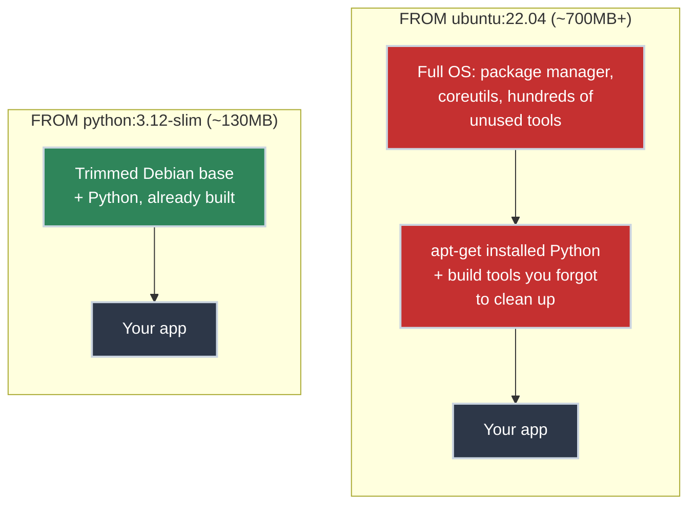
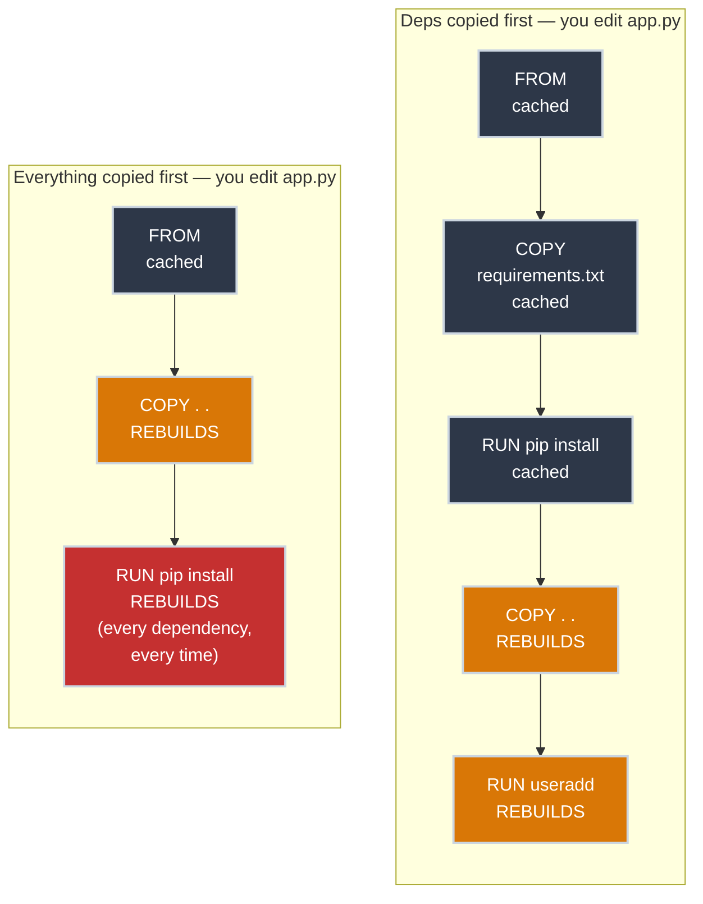

# Writing Your First Dockerfile

!!! tip "Part of Day One: Containerizing a Single App"
    This is the first article in [Containerizing a Single App](../overview.md#containerizing-a-single-app). Read [What Is a Container, Really?](../what_is_a_container.md) first if you haven't, and make sure `docker` actually runs on your machine — [Getting Docker Running on Your Machine](../getting_docker_running.md) covers that if it doesn't yet.

Working code that runs fine on one machine is the easy part. The moment someone needs it to run *anywhere else*, "it works on my machine" stops being an acceptable answer.

A Dockerfile is the fix: a plain-text list of instructions that tells Docker exactly how to build an image containing your app and everything it needs to run. Not a script that Docker executes top to bottom like a shell script — a series of layered steps, each one building on the last.

!!! tip "Docker or Podman? Everything Here Works with Both"
    Day One teaches with `docker` commands because Docker is what you're most likely to meet first at work. But [Podman](https://podman.io/) deserves your attention early: it runs containers **without a root daemon** and **rootless by default** — the security posture this site teaches as the standard, built in rather than bolted on. Its CLI is deliberately Docker-compatible: every command in this pathway works with `podman` swapped in for `docker` (and `alias docker=podman` is a common, supported setup). Even the Dockerfile format is shared — Podman builds the same file, unchanged. [Getting Docker Running on Your Machine](../getting_docker_running.md) covers installing either one; Essentials will cover Podman's own concepts properly (rootless containers, pods, systemd integration). Nothing you learn here locks you into Docker.

## What You'll Learn

- The instructions every Dockerfile needs, and what each one actually does
- Why your `FROM` line almost never needs to be a full operating system
- Why instruction *order* affects how fast your builds are
- The non-root default you should reach for from day one, not bolt on later

## The Instructions, One at a Time

Here's a complete Dockerfile for a small Python API. The shape is the same whatever language you wrote your app in; only the specific commands change.

``` bash title="Dockerfile" linenums="1"
FROM python:3.12-slim  # (1)!

WORKDIR /app  # (2)!

COPY requirements.txt .  # (3)!
RUN pip install --no-cache-dir -r requirements.txt

COPY . .  # (4)!

RUN useradd --create-home appuser  # (5)!
USER appuser

EXPOSE 8000  # (6)!

CMD ["python", "app.py"]  # (7)!
```

1. The base image: a starting point, already built by someone else, that your image is layered on top of. `slim` trims the base to just what's needed, keeping the final image smaller.
2. Every instruction after this runs from `/app` inside the image. Created automatically if it doesn't exist.
3. Copy *only* the dependency manifest first, not the whole app yet, then install dependencies as their own layer before your code is copied in. This ordering is what makes builds fast; more on that below.
4. Now copy the rest of your application code.
5. Create a non-root user and switch to it for everything after this point, including the running container. The base image runs as `root` by default; you don't want your app running as root inside the container.
6. Documents which port the app listens on. This doesn't publish the port by itself; [Building and Running Your Image](build_and_run.md) covers actually exposing it.
7. The command that runs when a container starts from this image. Runs as `appuser`, not `root`, because of the `USER` line above.

!!! warning "Non-Root Isn't Optional Advice — It's the Default"
    A container running as root isn't automatically dangerous, but it removes a layer of protection for free. If your app has a vulnerability that lets an attacker execute code, root-in-container is one fewer thing standing between that and root-on-host in some misconfigurations. Adding two lines (`useradd` + `USER`) costs you nothing here. There's no reason to skip it, even for a first Dockerfile.

## Choosing a Base Image: You Don't Need an Operating System

If you've never written a Dockerfile before, the first instinct is usually to reach for the operating system you already know: `FROM ubuntu:22.04`, then `RUN apt-get update && apt-get install -y python3 python3-pip`, and build up from there the way you'd set up a real server. It feels familiar. It's also the single most common, and most expensive, mistake a first Dockerfile makes.

Remember [what a container actually is](../what_is_a_container.md#two-ways-to-isolate-a-program): a process borrowing the host's kernel, not a machine that needs its own operating system installed on it. Your base image doesn't need to be a general-purpose OS distribution — it needs to contain exactly enough filesystem for your process to run and nothing else. `ubuntu:22.04` ships a package manager, a full set of coreutils, and hundreds of megabytes of tools your app will never call. None of that helps your app start faster or run better. All of it is now something you have to pull, store, scan for vulnerabilities, and patch, for zero benefit to the one process you actually care about.



The fix is what the Dockerfile above already does: start from an **official language image** instead. `python:3.12-slim`, `node:20-slim`, and their equivalents for every major language are maintained by the language project or Docker itself, and contain exactly the runtime plus a trimmed set of supporting OS packages — nothing you'd need to `apt-get install` by hand, and nothing extra hanging around as attack surface. `FROM python:3.12-slim` isn't a style choice at the top of this article's Dockerfile; it's already the answer to "which OS do I need," and the answer is *as little as possible*.

!!! info "The Suffix Ladder: -slim, -alpine, and Beyond"
    Official language images usually come in a few sizes. `-slim` (used throughout this article) is the sensible Day One default: small, but still built on a real Debian base with a shell and a package manager, which matters because [Debugging a Container That Won't Behave](debugging.md) relies on being able to `docker exec -it` into a container and get a shell. `-alpine` variants are smaller still, but swap in a different C library (`musl` instead of `glibc`), which occasionally breaks compiled dependencies in ways that are genuinely confusing to debug on your first Dockerfile — worth knowing it exists, not worth reaching for yet. Squeezing an image down further than that (multi-stage builds, distroless images with no shell at all) is real production optimization, and it's exactly where Mastery picks this up once you're optimizing for size and attack surface instead of just getting something working.

## Why Instruction Order Matters

Docker builds an image in layers, and it caches each layer. If a layer hasn't changed since the last build, Docker reuses it instead of rebuilding it. That's *why* the Dockerfile above copies `requirements.txt` and installs dependencies **before** copying the rest of the code.

Picture the alternative, copying everything first and installing dependencies after:

``` dockerfile title="The Slow Way — Don't Do This"
FROM python:3.12-slim
WORKDIR /app
COPY . .
RUN pip install --no-cache-dir -r requirements.txt
CMD ["python", "app.py"]
```

Change one line of application code, rebuild, and Docker sees the `COPY . .` layer changed, which invalidates every layer after it, including the dependency install. You'd reinstall every dependency on every single code change, even though none of them actually changed.

Here's the same edit hitting both orderings — where the cache breaks is the whole difference:



Copying the dependency manifest first means that layer only invalidates when your dependencies *actually* change. Everyday code edits skip straight to the fast part. This is a Day One–level heads-up, not the full picture; Essentials will go deep on how Docker decides what to invalidate, and how to structure larger builds around it, when it covers image layers and caching.

## Keep the Build Context Small

`docker build` sends everything in your project directory to Docker as the "build context": your `.git` folder, virtual environments, and anything else sitting nearby, unless you tell it not to. A `.dockerignore` file excludes what shouldn't make the trip:

``` text title=".dockerignore"
.git
__pycache__/
*.pyc
.venv/
.env
```

That last line matters beyond speed: `.env` files often hold secrets. `.dockerignore` keeps them out of the build context entirely, so there's no chance of a stray `COPY . .` baking a credential into an image layer — where it would sit, readable, in every place that image ever gets pulled.

## Watch Out For

- **Starting from a general-purpose OS image (`ubuntu`, `debian`, `centos`) instead of a language-specific one.** It's a bigger download, a slower build, and more attack surface for the exact same running app — see [Choosing a Base Image](#choosing-a-base-image-you-dont-need-an-operating-system) above.
- **Using `:latest` as your base image tag.** `python:3.12-slim` is reproducible; `python:latest` will quietly become a different image every time it's rebuilt, weeks or months from now, and break in ways that are hard to trace back to "the base image changed."
- **Baking in secrets.** API keys, database passwords, and tokens don't belong in a `COPY`'d file or a hardcoded `ENV` line — they end up permanently in the image's layers, extractable by anyone who can pull it. [Building and Running Your Image](build_and_run.md) covers passing them in at runtime instead.
- **Forgetting `EXPOSE` doesn't publish anything.** It's documentation for humans and other tooling — the actual port mapping happens when you run the container, not when you build it.

## Practice Exercises

??? question "Exercise 1: Rescue an Oversized Dockerfile"
    You're handed this Dockerfile for a small Python script:

    ``` dockerfile title="Dockerfile"
    FROM ubuntu:22.04
    RUN apt-get update && apt-get install -y python3 python3-pip
    WORKDIR /app
    COPY . .
    RUN pip3 install -r requirements.txt
    CMD ["python3", "app.py"]
    ```

    It works, but the image is over 500MB for a script with two dependencies. Fix the `FROM` line and explain what you removed.

    ??? tip "Solution"
        ``` dockerfile title="Dockerfile" linenums="1"
        FROM python:3.12-slim
        WORKDIR /app
        COPY requirements.txt .
        RUN pip install --no-cache-dir -r requirements.txt
        COPY . .
        CMD ["python", "app.py"]
        ```

        Swapping `ubuntu:22.04` + a manual `apt-get install` for `python:3.12-slim` removes an entire general-purpose OS's worth of unused packages, along with the `apt-get update` cache and package manager metadata that `apt-get install` leaves behind. The official Python image already contains exactly the runtime this script needs, maintained and patched by people whose job is maintaining it, instead of a pile of packages you now own.

??? question "Exercise 2: Fix the Cache-Busting Dockerfile"
    You're handed this Dockerfile for a Node.js app:

    ``` dockerfile title="Dockerfile"
    FROM node:20-slim
    WORKDIR /app
    COPY . .
    RUN npm install
    CMD ["node", "server.js"]
    ```

    Rewrite it so that editing `server.js` doesn't force `npm install` to rerun.

    ??? tip "Solution"
        ``` dockerfile title="Dockerfile" linenums="1"
        FROM node:20-slim
        WORKDIR /app
        COPY package*.json ./
        RUN npm install
        COPY . .
        CMD ["node", "server.js"]
        ```

        Copying `package.json` and `package-lock.json` first means the `npm install` layer only invalidates when dependencies change, not on every source edit.

??? question "Exercise 3: Add the Non-Root Default"
    Add a non-root user to the fixed Dockerfile from Exercise 1, and make sure the app actually runs as that user.

    ??? tip "Solution"
        ``` dockerfile title="Dockerfile" linenums="1"
        FROM node:20-slim
        WORKDIR /app
        COPY package*.json ./
        RUN npm install
        COPY . .
        RUN useradd --create-home appuser
        USER appuser
        CMD ["node", "server.js"]
        ```

        `USER appuser` has to come after the files are in place and dependencies are installed: anything that needs write access to `/app` (like `npm install`) should still run before you drop privileges, unless you've explicitly given `appuser` ownership of those files.

## Quick Recap

| Instruction | What It Does |
|-------------|---------------|
| `FROM` | Sets the base image everything else builds on |
| `WORKDIR` | Sets the working directory for every instruction after it |
| `COPY` | Copies files from your machine into the image |
| `RUN` | Executes a command while building the image (installs, setup) |
| `USER` | Switches the user the rest of the instructions — and the running container — run as |
| `EXPOSE` | Documents which port the app listens on |
| `CMD` | The command that runs when a container starts |

## What's Next

You've got a Dockerfile. Now build an image from it and actually run it: **[Building and Running Your Image](build_and_run.md)**.

## Further Reading

### Official Documentation

- [Dockerfile Reference](https://docs.docker.com/reference/dockerfile/) — every instruction, in full
- [Docker Build Best Practices](https://docs.docker.com/build/building/best-practices/) — the official guidance this article's defaults are drawn from

### Related Articles

- [What Is a Container, Really?](../what_is_a_container.md) — the image-vs-container distinction this article builds on
- [Day One Overview](../overview.md) — see both Day One pathways
