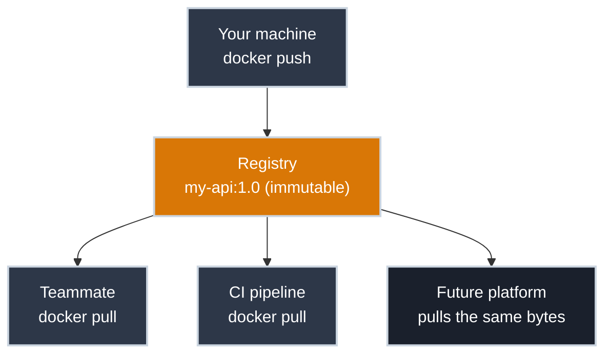

# Sharing It With Your Team

!!! tip "Part of Day One: Containerizing a Single App"
    Fourth and final article in [Containerizing a Single App](../overview.md#containerizing-a-single-app).

The container works. It builds, it runs, you've debugged the inevitable first snag. And it's sitting entirely on your laptop, which means, as far as your team or any platform is concerned, it doesn't exist yet.

You can't email an image or zip up `docker images` output (well, you technically can `docker save` one to a file, but nobody does this as a workflow). The actual answer is a **registry**: a server that stores images and hands them out on request, the same relationship a Git remote has to your local repo, or `npm` has to a `node_modules` folder. You push a version up; anyone with access pulls it back down, byte-for-byte identical.



## Tagging With Intent

Before pushing anywhere, an image's tag needs to say two things: which registry it belongs to, and which version this is.

``` bash title="Tag the Image for a Registry"
docker tag my-api:1.0 yourusername/my-api:1.0
```

`yourusername/my-api:1.0` breaks down as `<registry-namespace>/<image-name>:<version>`. That namespace is what tells Docker *where* to push when you ask it to. Omit it, and Docker assumes Docker Hub's default namespace, which is rarely what you want once more than one person is involved.

!!! warning "Still No `:latest`"
    The same reasoning from [Writing Your First Dockerfile](first_dockerfile.md) applies with more force here: `:latest` pushed to a shared registry means every teammate who pulls it gets whatever was pushed most recently, with no way to know which version that actually was. Pin a real version (`1.0`, `1.1`, a Git commit SHA, whatever your team's convention is) every time you push something meant to be shared.

## Pushing the Image

⚠️ **Caution (Publishes to a Remote Registry):**

``` bash title="Log In, Then Push"
docker login
# Username: yourusername
# Password: ****

docker push yourusername/my-api:1.0
# The push refers to repository [docker.io/yourusername/my-api]
# a1b2c3d4e5f6: Pushed
# 1.0: digest: sha256:9f8e7d6c... size: 1573
```

Docker only uploads the layers the registry doesn't already have. If your base image (`python:3.12-slim`) is already public, you're really only pushing the layers unique to your app.

!!! info "Docker Hub vs. a Company Registry"
    This article uses Docker Hub because it's free and immediately accessible for practicing the mechanics. At a company, you'll almost always push to a **private registry** your platform team runs instead; the commands are identical, just pointed at a different address (`docker tag my-api:1.0 registry.yourcompany.com/my-api:1.0`, then push there). The Efficiency tier will cover self-hosting one; for Day One, the mechanics transfer directly regardless of which registry is on the other end.

## Pulling It Somewhere Else

This is the payoff, on a teammate's machine, in CI, or on whatever platform eventually runs it:

✅ **Safe (Read-Only):**

``` bash title="Pull the Image Anywhere"
docker pull yourusername/my-api:1.0
docker run -d -p 8000:8000 --env-file .env.local yourusername/my-api:1.0
```

No source code changed hands, no "works on my machine" conversation happened. The image pulled down is bit-for-bit what you built and tested — the entire point of the [image being immutable](../what_is_a_container.md#image-vs-container-the-blueprint-and-the-building).

!!! info "Where This Push Leads in a Real Pipeline"
    [Building the Image](build_and_run.md#building-the-image) already flagged that a CI pipeline runs `docker build` in practice, not you by hand — the same is true of this `docker push`. [Exploring GitOps](https://gitops.bradpenney.io)'s [Your Flux Workflow](https://gitops.bradpenney.io/day_one/your_flux_workflow/) picks up from there, and it's worth knowing one thing upfront: a GitOps deployment involves *two* separate OCI artifacts landing in the registry, not one. The image you just pushed is the first — the second is a completely separate artifact packaging the Kubernetes manifests that declare which image tag to run, and that second artifact, not the image itself, is what Flux actually watches.

## Watch Out For

- **Pushing to a public repository by accident.** Docker Hub's default visibility depends on your account settings — double-check before pushing anything with proprietary code baked in, and prefer a private repository or your company's registry for anything that isn't meant to be public.
- **Assuming a successful push means a working image.** The registry doesn't test your image, it just stores it. Pull it fresh somewhere and run it before telling your team it's ready — a `.env.local` that only exists on your machine is an easy way to ship something that "works" only for you.
- **Treating the registry as a backup for images with secrets in them, because "it's private anyway."** Private repositories still have members, still get misconfigured, and still get audited. The [rule from the first Dockerfile article](first_dockerfile.md#watch-out-for) (no secrets baked into the image) doesn't get an exception because the destination is private.

## Practice Exercises

??? question "Exercise 1: Tag and Push a Real Version"
    You've fixed a bug in `my-api`, previously pushed as `1.0`. Tag and push the fix as a new version without overwriting `1.0`.

    ??? tip "Solution"
        ``` bash title="Build, Tag, Push a New Version"
        docker build -t my-api:1.1 .
        docker tag my-api:1.1 yourusername/my-api:1.1
        docker push yourusername/my-api:1.1
        ```

        `1.0` stays exactly as it was, still pullable, so anyone depending on it isn't affected. `1.1` is a distinct, addressable version. This is the entire value of pinned tags: nothing gets silently replaced out from under someone.

??? question "Exercise 2: Reproduce It Cleanly"
    Prove the image is actually shareable: remove the local image and container, then pull and run purely from the registry.

    ??? tip "Solution"
        ``` bash title="Remove Local Copies"
        docker stop my-api-dev
        docker rm my-api-dev
        docker rmi yourusername/my-api:1.0

        docker pull yourusername/my-api:1.0
        docker run -d -p 8000:8000 --env-file .env.local --name my-api-dev yourusername/my-api:1.0
        curl http://localhost:8000/health
        ```

        If this works with nothing local except the `.env.local` values, the image genuinely doesn't depend on anything specific to your machine. That's the actual test of "shareable," not just "it built."

## Quick Recap

| Command | What It Does |
|---------|---------------|
| `docker tag src:tag registry-namespace/name:tag` | Adds a registry-addressable tag to an existing image |
| `docker login` | Authenticates to a registry |
| `docker push` | Uploads an image (its new layers) to a registry |
| `docker pull` | Downloads an image from a registry |

## What's Next

That's the full Day One arc for a single app: Dockerfile, build, run, debug, ship. From here, the Essentials tier — being written next — will go deeper into the tools (Docker and Podman both), the runtimes underneath them, and the security discipline that matters once this image is running somewhere you don't control.

If your actual situation is a large, VM-hosted application rather than one clean service, the [Breaking Up a Monolith](../overview.md#breaking-up-a-monolith) pathway starts from [Why the Monolith Has to Move](../monolith/why_it_has_to_move.md).

## Further Reading

### Official Documentation

- [Docker Hub Documentation](https://docs.docker.com/docker-hub/) — repositories, visibility settings, access tokens
- [`docker push` Reference](https://docs.docker.com/reference/cli/docker/image/push/)

### Related Learning

- [Your Flux Workflow](https://gitops.bradpenney.io/day_one/your_flux_workflow/) — what automates the push you just did by hand, and the config-repo artifact that actually gets deployed

### Related Articles

- [Writing Your First Dockerfile](first_dockerfile.md) — the secrets-out-of-the-image rule this article extends to shared registries
- [Day One Overview](../overview.md) — see both Day One pathways
