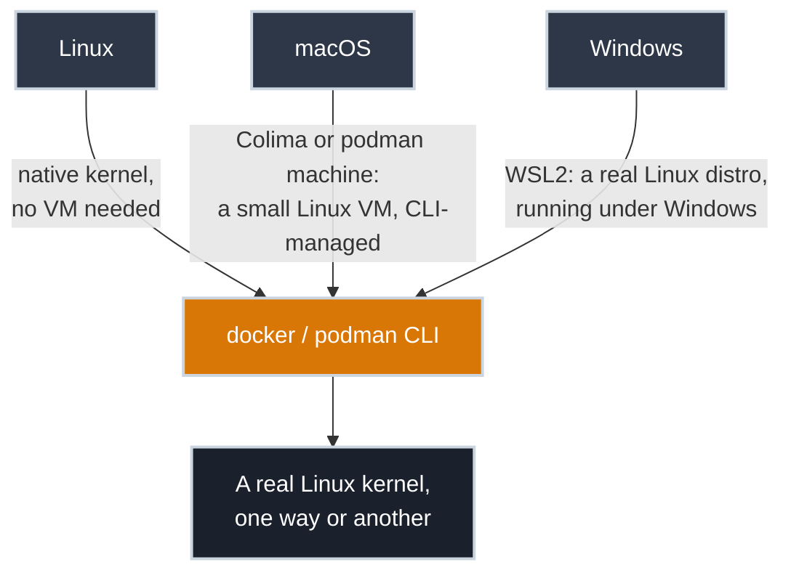

# Getting Docker Running on Your Machine

!!! tip "Part of Day One: Your App Has to Become a Container"
    Third article in the shared foundation, after the [Overview](overview.md) and [What Is a Container, Really?](what_is_a_container.md), and before you pick a pathway. Skip straight to [Writing Your First Dockerfile](app/first_dockerfile.md) if `docker run hello-world` already works on your machine.

Everything from here on assumes `docker` (or `podman`) is a command you can actually run. If it already is, skip this article — the check above just told you so. If it isn't, this is the one piece of infrastructure standing between you and the rest of Day One, and it's worth setting up right the first time instead of clicking through an installer that leaves you fighting a menu-bar app later.

One thing decided upfront: everything below is command-line only. No Docker Desktop. Not because it doesn't work, but because it's a GUI-first app running a background daemon you manage by clicking, and this site teaches the tooling the way you'll actually use it elsewhere: from a terminal, with nothing to click, because that's what a remote server, a CI runner, or an SSH session gives you. What you learn here should be the same thing you do everywhere else.

## Why Every OS Needs Something Different Underneath

[What Is a Container, Really?](what_is_a_container.md#two-ways-to-isolate-a-program) established that a container shares the host's kernel. Linux has that kernel natively — installing Docker or Podman there is just installing a program. macOS and Windows don't have a Linux kernel at all, so on those two, "installing Docker" always means running a small Linux virtual machine somewhere underneath, whether or not the tool admits it. Docker Desktop hides that VM behind a GUI you manage with a mouse. The tools below don't hide it, and don't make you click anything to manage it — you start it, stop it, and forget about it from the same terminal you do everything else in.



## Installing It

=== ":material-linux: Linux"

    No VM required — you're already running the kernel everything else needs.

    **Docker**, via the distribution's own package:

    ``` bash title="Install Docker (Debian/Ubuntu)"
    sudo apt update
    sudo apt install -y docker.io
    sudo systemctl enable --now docker
    sudo usermod -aG docker "$USER"
    ```

    ``` bash title="Install Docker (Fedora)"
    sudo dnf install -y moby-engine
    sudo systemctl enable --now docker
    sudo usermod -aG docker "$USER"
    ```

    !!! warning "Log Out and Back In"
        `usermod -aG docker` adds you to the group that can talk to Docker without `sudo` on every command — but the change doesn't apply to your *current* login session. Log out and back in (or run `newgrp docker` in your current shell) before the `docker` commands below will work without `sudo`.

    !!! info "RHEL Doesn't Ship Docker at All"
        Unlike Fedora, RHEL's default repos don't carry Docker in any package name — RHEL's own container story is Podman, which *is* in the default repos (see below). Getting Docker itself onto RHEL means adding Docker's official repository, a bigger step than this article's "one package, one command" scope. If you're on RHEL, Podman is the path of least resistance, not just an alternative.

    **Podman** is the simpler story on Linux specifically: no daemon, no group to join, one install command.

    ``` bash title="Install Podman Instead (Debian/Ubuntu)"
    sudo apt install -y podman
    ```

    ``` bash title="Install Podman Instead (Fedora/RHEL)"
    sudo dnf install -y podman
    ```

    Pick one to start with — [Writing Your First Dockerfile](app/first_dockerfile.md) works identically either way.

=== ":material-apple: macOS"

    No Linux kernel here, so every path below runs a small VM underneath — the difference from Docker Desktop is that you drive it from the terminal, not a GUI.

    **Docker**, via [Colima](https://github.com/abiosoft/colima) — installs the real `docker` CLI, wired into a Colima-managed VM:

    ``` bash title="Install and Start Docker via Colima (Homebrew)"
    brew install docker colima
    colima start
    ```

    That's the whole setup. No account, no menu-bar icon, no GUI at any point — `colima start` brings up the VM in the background, and `docker` commands work immediately afterward.

    **Podman**, via its own VM tooling:

    ``` bash title="Install and Start Podman (Homebrew)"
    brew install podman
    podman machine init
    podman machine start
    ```

    !!! info "First Start Takes a Minute"
        Both `colima start` and `podman machine start` need to download and boot a Linux VM image the first time. Subsequent starts are much faster — the image is cached.

=== ":material-microsoft-windows: Windows"

    The short version: get a real Linux environment running under Windows, then follow the **:material-linux: Linux** tab's instructions inside it, unchanged. There's no Windows-specific version of any of this worth learning.

    ``` powershell title="Install WSL2 (PowerShell, as Administrator)"
    wsl --install
    ```

    Restart when it asks you to. On first launch it installs Ubuntu by default and has you set up a Linux username and password — after that, you're sitting inside a genuine Linux distribution, running under Windows, not some translated or partial version of one.

    !!! warning "Skip Docker Desktop's WSL2 Backend"
        Most tutorials point you toward installing Docker Desktop on the Windows side and enabling its "WSL2 backend" — that's the GUI path this site avoids. Instead, open your WSL2 distro's terminal and run the install commands from the **:material-linux: Linux** tab directly inside it. No Windows-side app required at all.

## Confirm It Works

Whichever tool you installed, one command proves the whole chain, from CLI to VM (if you needed one) to a running container:

=== "Docker"

    ✅ **Safe (Read-Only):**

    ``` bash title="Run the Test Container"
    docker run hello-world
    # Hello from Docker!
    # This message shows that your installation appears to be working correctly.
    # ...
    ```

=== "Podman"

    ✅ **Safe (Read-Only):**

    ``` bash title="Run the Test Container"
    podman run hello-world
    # Hello from Docker!
    # This message shows that your installation appears to be working correctly.
    # ...
    ```

    (Yes, the message still says "Docker" — it's baked into the `hello-world` image itself, not something Podman controls. The image runs identically under either tool.)

If that printed the welcome message, everything downstream in Day One (building, running, debugging, sharing) works exactly as written from here.

## Watch Out For

- **"Permission denied" talking to the Docker daemon, right after install (Linux).** You added yourself to the `docker` group, but your current shell session predates that change. Log out and back in, or run `newgrp docker`.
- **Running WSL commands from PowerShell instead of inside the Linux shell.** `wsl --install` sets up the environment; it doesn't change what shell you're typing into. Open the "Ubuntu" app from the Start menu (or type `wsl` in a terminal) to actually get the Linux prompt before running any `apt`/`docker` commands.
- **Installing both Docker and Podman and being surprised which one answers to `docker`.** Some distributions ship a `podman-docker` package that aliases `docker` to `podman` — handy once you know it's there, confusing if you forgot you installed it. Pick one tool to learn on first; you can always add the other later.
- **A slow or resource-starved first container on macOS.** Colima and `podman machine` both default to modest CPU/memory allocations for the VM. If things feel sluggish, `colima start --cpu 4 --memory 8` (or the equivalent `podman machine` flags) gives it more room.

## Practice Exercises

??? question "Exercise 1: Verify and Identify"
    Run the test container for whichever tool you installed. Without looking back at this article, explain in one sentence what actually happened between typing the command and seeing "Hello from Docker!" — naming every layer involved.

    ??? tip "Solution"
        The CLI (`docker` or `podman`) talked to a container engine — either running natively (Linux) or inside a small Linux VM (macOS, or WSL2 on Windows) — which pulled the `hello-world` image from a registry, ran it as a container, and streamed its output back to your terminal. Every OS ends up at the same place: a real Linux kernel running a real container, just with a different amount of machinery between you and it.

??? question "Exercise 2: Confirm Group Membership Took Effect (Linux only)"
    On Linux, after adding yourself to the `docker` group and logging back in, confirm the membership actually applied — without just re-running `docker run hello-world` and hoping.

    ??? tip "Solution"
        ``` bash title="Check Group Membership"
        groups
        # should list "docker" among the output
        ```

        If `docker` isn't listed, the login/`newgrp` step didn't take effect — log out fully (not just close the terminal window) and back in, then check again.

## Quick Recap

| OS | Tool | What Runs the Container | Install Path |
|---|---|---|---|
| Linux | Docker or Podman | The host kernel, directly | `apt`/`dnf` package, no VM |
| macOS | Docker | Colima-managed Linux VM | `brew install docker colima && colima start` |
| macOS | Podman | `podman machine`-managed VM | `brew install podman && podman machine init && podman machine start` |
| Windows | Docker or Podman | A real Linux distro under WSL2 | `wsl --install`, then the Linux path inside it |

## What's Next

With `docker` (or `podman`) confirmed working, the path splits by your situation: **[Writing Your First Dockerfile](app/first_dockerfile.md)** if you're containerizing a single app, or **[Why the Monolith Has to Move](monolith/why_it_has_to_move.md)** if you're breaking up something bigger.

## Further Reading

### Official Documentation

- [Docker Engine Install Docs](https://docs.docker.com/engine/install/) — official, distro-by-distro install instructions
- [Podman Installation](https://podman.io/docs/installation) — official install instructions, all platforms
- [Colima](https://github.com/abiosoft/colima) — the CLI-first Docker runtime for macOS this article uses
- [Install WSL](https://learn.microsoft.com/en-us/windows/wsl/install) — Microsoft's official WSL2 setup guide

### Related Articles

- [What Is a Container, Really?](what_is_a_container.md) — the kernel-sharing concept this article's OS differences come from
- [Day One Overview](overview.md) — see both Day One pathways
