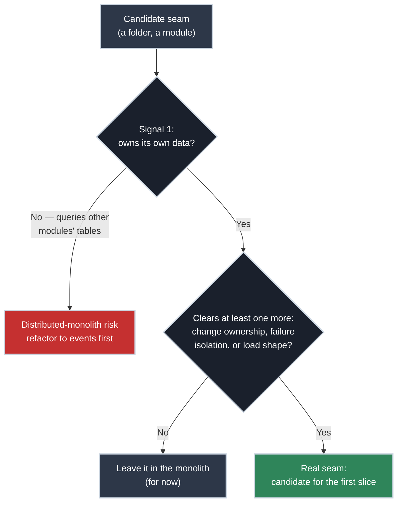

# Finding the Seams: How to Scope a Microservice

!!! tip "Part of Day One: Breaking Up a Monolith"
    Second article in [Breaking Up a Monolith](../overview.md#breaking-up-a-monolith). Assumes you've read [Why the Monolith Has to Move](why_it_has_to_move.md).

Open the codebase and start looking for services, and you'll find them everywhere: a folder called `billing`, a package called `notifications`, a module called `reporting`. It looks like the decomposition is already halfway done. It isn't. A folder boundary is something a developer drew for their own convenience while writing the code; a service boundary has to survive contact with data, deployment, and failure — and most folder boundaries don't.

## Four Signals That Tell You a Seam Is Real

### 1. Data Ownership

Ask: if this piece became its own service, would it need to query another service's tables directly to do its job? If the answer is yes, it isn't a seam yet — it's two things sharing one database, which means splitting them into separate deployables adds network calls without actually decoupling anything.

**Real seam:** a notifications module that owns its own delivery log and subscription preferences, and only ever *receives* events from the rest of the app. It never reaches back into `orders` or `users` tables directly.

**Not yet a seam:** a "reporting" module that runs ad-hoc SQL joins across `orders`, `inventory`, and `users` to build a dashboard. Splitting this off means either replicating that data into its own store (real work, not a Dockerfile problem) or leaving it permanently dependent on live access to three other services' data.

### 2. Change Frequency and Ownership

Ask: does this piece change on its own schedule, by its own team, or does it always get modified alongside the same other pieces by the same people? Code that always ships together doesn't benefit from being deployed separately; it just adds coordination overhead for no independence gained.

**Real seam:** the checkout flow, owned by one team, that changes weekly for pricing and promotion logic, while the user-profile module, owned by a different team, changes maybe twice a year.

**Not yet a seam:** two modules that are always touched in the same pull requests, by the same two developers, because they were never really separate concerns to begin with.

### 3. Failure Isolation

Ask: if this piece crashes or hangs, does it take down something that has nothing to do with it? That's not a hypothetical to reason about in the abstract — it's usually something you already have a war story for.

**Real seam:** a nightly bulk-export job that, because it runs in the same process as the web application, once ran out of memory and took the entire site down with it. That's a concrete, already-happened signal that this piece needs its own failure boundary.

**Not yet a seam:** two pieces that have simply never failed independently, because nobody's checked. Absence of an incident isn't evidence of isolation, just evidence you haven't looked yet.

### 4. Load Shape

Ask: does this piece need to scale differently from the rest of the app, with different traffic patterns or a different resource profile (CPU-heavy vs. memory-heavy vs. bursty vs. steady)? If everything in the monolith scales together just fine today, there's no scaling argument for splitting it, even if one exists later.

**Real seam:** image or video processing that spikes hard and briefly, sitting inside an otherwise steady, low-CPU web application. Scaling the whole monolith to handle those spikes wastes resources on the parts that never needed it.

!!! tip "It's About Coherence, Not a Magic Number"
    There's no resource threshold that marks a service as properly sized: no universal core count or memory ceiling that means you've decomposed enough. A single, well-scoped service can legitimately be resource-hungry (a video transcoder wanting 32 cores is still one coherent thing); a monolith can be resource-light and still very much be a monolith (a modest CRUD app running at 2 cores is still one process doing five unrelated jobs). What actually matters is whether the resource profile is *coherent* for one workload, or a *mismatched bundle* of several — a batch job's memory spike hiding inside an API's steady-state request, each with a different shape, sharing one container because nobody ever separated them. Coherent and heavy is fine. Mismatched and light is still a signal.

## The Trap: Cutting Along Code Convenience

The seam that's easiest to find in the code (a folder, a package, a class hierarchy) is not reliably the seam that's actually there. Split along a boundary that fails all four signals above, and you get a **distributed monolith**: two or more services, deployed and scaled separately on paper, that still share a database, still change together, still fail together, and now also make network calls to talk to each other. That's strictly worse than the monolith you started with — the coupling never left, but you added latency, network failure modes, and operational overhead on top of it.

!!! danger "The Distributed Monolith Is a Known Failure Mode, Not a Rare Mistake"
    This isn't a hypothetical edge case. It's one of the most common outcomes when a monolith gets split along whatever boundary was visually obvious in the code, without checking data ownership first. If a proposed split fails signal 1 (data ownership), the other three signals rarely save it.

## Scoring a Candidate Seam

Before committing to split a piece off, check it against all four signals honestly:

-   :material-database: **Data Ownership**

    ---

    Can it own its data and only communicate through events or an API, never a direct query into someone else's tables?

-   :material-account-group: **Change Ownership**

    ---

    Does it change on a different cadence, by a different team, than the rest of the monolith?

-   :material-shield-alert: **Failure Isolation**

    ---

    Has it already caused (or could it plausibly cause) a failure that has nothing to do with its own function?

-   :material-chart-line: **Load Shape**

    ---

    Does it have a genuinely different resource or traffic profile than the rest of the app?

A piece that clears data ownership and at least one other signal is a strong candidate. A piece that only clears "it's in its own folder" is not. [Containerizing the First Slice](first_slice.md) assumes you're starting with the strongest candidate you've got, not the most visually obvious one.

## Practice Exercises

??? question "Exercise 1: Score a Candidate"
    A monolith has an `email_sender` module. It owns no database tables of its own: every email it sends is triggered by reading rows directly out of the `orders` and `users` tables to decide what to send and to whom. It's touched in nearly every pull request that changes order logic. Score it against the four signals. Is it a real seam?

    ??? tip "Solution"
        **Data ownership: fails.** It reads directly from other modules' tables instead of owning its own data or receiving events. **Change ownership: fails.** It's modified alongside order logic constantly, not on its own cadence. Even if failure isolation or load shape look favorable, this module fails the two heaviest-weighted signals — splitting it off today would produce a distributed monolith: a separate deployable that still needs synchronous, direct access to two other services' databases to function.

??? question "Exercise 2: Redesign Before Splitting"
    Using the same `email_sender` module, describe the smallest change that would make it a real seam, without yet actually splitting it into a separate service.

    ??? tip "Solution"
        Change it from *pulling* data via direct queries to *reacting* to events: order logic publishes an "order placed" event with the data email_sender needs already attached, and email_sender only ever consumes those events, never queries `orders` or `users` directly. That single change (decoupling by event instead of by shared table) is what turns a failing data-ownership signal into a passing one. Only after that refactor is the module actually ready to become its own deployable — the seam has to exist in the design before it can exist as a separate container.

## Quick Recap

| Signal | Question | Red Flag |
|---|---|---|
| **Data ownership** | Can it own its own data? | Needs direct queries into another module's tables |
| **Change ownership** | Different team, different cadence? | Always modified in the same PRs as other modules |
| **Failure isolation** | Does its failure stay contained? | A crash here has already taken down something unrelated |
| **Load shape** | Different scaling needs? | Scales identically to the rest of the app, always |

## What's Next

Once you've got a candidate seam that clears data ownership and at least one other signal, containerize it on its own: **[Containerizing the First Slice](first_slice.md)**.

## Further Reading

### Deep Dives

- [Martin Fowler: MonolithFirst](https://martinfowler.com/bliki/MonolithFirst.html) — why starting with a monolith and splitting deliberately usually beats designing microservices from scratch
- [Martin Fowler: Bounded Context](https://martinfowler.com/bliki/BoundedContext.html) — the domain-driven-design idea underneath "data ownership" as a signal
- [Sam Newman: *Monolith to Microservices*](https://samnewman.io/books/monolith-to-microservices/) — a full book's worth of patterns for exactly this decision; the four signals here are a starting point, this is the deep end

### Related Articles

- [Why the Monolith Has to Move](why_it_has_to_move.md) — why containerizing the whole thing first is a legitimate checkpoint before this decision
- [Day One Overview](../overview.md) — see both Day One pathways
