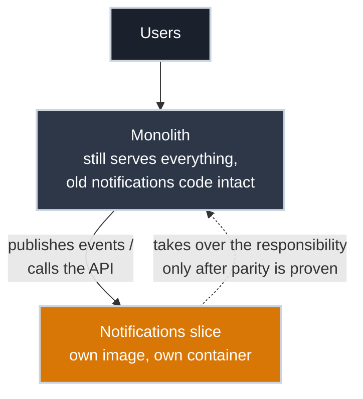

# Containerizing the First Slice

!!! tip "Part of Day One: Breaking Up a Monolith"
    Third article in [Breaking Up a Monolith](../overview.md#breaking-up-a-monolith). Assumes you've scored a candidate against the four signals in [Finding the Seams](finding_the_seams.md).

A piece has cleared data ownership and at least one other signal — say, the notifications module from the [previous article's exercise](finding_the_seams.md#practice-exercises), now decoupled to consume events instead of querying other modules' tables directly. It's still living inside the monolith's codebase, deployed as part of the same process. The first slice is about proving it doesn't have to be.

The goal here isn't to migrate everything. It's to run **one piece, independently, next to the still-intact monolith**, and confirm the approach actually works before committing the rest of the application to it.

## Give the Slice an Interface

Before it can run on its own, the slice needs an explicit way in and out: something that doesn't assume it's sharing a process, a memory space, or a direct database connection with the rest of the app anymore. Two honest options:

- **Event-driven:** the monolith publishes events (a message queue, a log the slice tails, whatever's already available); the slice consumes them and acts independently. This is the looser coupling, and the one [Finding the Seams](finding_the_seams.md) pushed toward for exactly this reason.
- **Synchronous API call:** the monolith calls the slice over HTTP for anything it needs immediately. Simpler to build first, but it reintroduces a runtime dependency — if the slice is down, whatever calls it synchronously now fails too, in a way an event queue would have buffered instead.

Neither is universally right. An event pipeline you don't already have is real infrastructure work; sometimes a synchronous call is the honest, pragmatic first version, with the understanding that it's a step, not the destination. What matters is that the choice is deliberate, not whatever fell out of how the code happened to be structured before.

## Write the Dockerfile for Just This Piece

Mechanically, this is exactly [Writing Your First Dockerfile](../app/first_dockerfile.md): same instructions, same non-root default, same dependency-layer-before-code-layer ordering, applied to a much smaller surface area — whatever files the slice actually needs, not the whole monolith's repository.

``` dockerfile title="Dockerfile — the extracted notifications slice" linenums="1"
FROM python:3.12-slim

WORKDIR /app

COPY notifications/requirements.txt .
RUN pip install --no-cache-dir -r requirements.txt

COPY notifications/ .

RUN useradd --create-home appuser
USER appuser

CMD ["python", "consumer.py"]
```

If the slice still lives inside the monolith's repository rather than its own, the build context needs trimming down to just this subdirectory; otherwise you're shipping the entire monolith's source alongside a service that only needs a fraction of it. A [`.dockerignore`](../app/first_dockerfile.md#keep-the-build-context-small) or a build context scoped to the subdirectory both work; which one depends on how the repo is laid out.

## Run It Beside the Monolith, Not Instead Of It

This is the part that's different from Pathway A. You're not replacing anything yet — the monolith keeps running exactly as it did in [Why the Monolith Has to Move](why_it_has_to_move.md), and the new container runs alongside it, reachable at its own address:



✅ **Safe (Read-Only, Checking Both Are Up):**

``` bash title="Confirm Both Are Running"
docker ps
# CONTAINER ID   IMAGE                    STATUS         NAMES
# 3a4b5c6d7e8f   monolith:2.4             Up 2 hours     monolith
# 9f8e7d6c5b4a   notifications-slice:0.1  Up 3 minutes   notifications
```

The monolith still handles everything it always did, including, for now, whatever notifications logic hasn't been cut over yet. The new container is proven to run and respond, but nothing depends on it in production until you deliberately redirect that responsibility to it. This is the [strangler fig pattern](https://martinfowler.com/bliki/StranglerFigApplication.html) in miniature: the new piece grows up next to the old one, takes over one responsibility at a time, and the monolith only shrinks as pieces are actually, verifiably handed off — never all at once.

## Prove Parity Before You Cut Over

Getting the container to run isn't the bar. The bar is that it does the same thing the code it's replacing did, for the same inputs. Before redirecting real traffic or events to the new slice:

- Run both the old code path (inside the monolith) and the new slice against the same input, and diff the output
- Check timing-sensitive behavior specifically: a synchronous call inside a monolith and a network call to a new container have different latency and failure characteristics, even when the logic is identical
- Confirm what happens when the new slice is unreachable: does the monolith degrade gracefully, or does it now hang on something it never used to depend on?

## Watch Out For

- **Cutting over before proving parity.** The container running is a build success, not a behavior guarantee — the two are easy to conflate under deadline pressure.
- **Extracting more than one slice at once.** The entire point of a first slice is an isolated, reversible experiment. Two slices in flight simultaneously means two sets of new failure modes to debug at the same time, with no clean way to tell which one caused an incident.
- **Leaving the old code path live and untested "just in case."** Dead code that still technically runs, sharing state with the new slice in inconsistent ways, is worse than either committing to the cutover or not starting it.

## Practice Exercises

??? question "Exercise 1: Choose the Coupling"
    The notifications slice needs to know when an order ships, so it can send a shipping confirmation email. The monolith doesn't currently publish any events; there's no message queue in place. Is a synchronous API call from the monolith to the new slice a reasonable first version here, or a mistake?

    ??? tip "Solution"
        Reasonable, with eyes open. Building a message queue from nothing just to extract one slice is real infrastructure investment that may not be justified yet, so a synchronous call (the monolith calls the notifications service's `/notify` endpoint when an order ships) is a legitimate first version. The tradeoff to accept deliberately: if the notifications service is down, that call needs a timeout and a failure path that doesn't block the order from completing — the monolith's checkout flow can't be allowed to hang because an email service is unreachable.

??? question "Exercise 2: Decide the Rollback"
    You've cut over shipping-confirmation emails to the new notifications slice. Two days later, a bug causes some emails to be missed. What does having kept the monolith's original notification code (even if unused) actually buy you here?

    ??? tip "Solution"
        A fast, low-risk rollback: redirect the trigger back to the monolith's original code path while you fix the new slice, instead of firefighting the bug live in production with the only working system offline. This is the specific reason "extract, verify, then delete the old path" beats "extract and immediately delete" — the old path stops being useful the moment you're confident in the new one, but that confidence has to be earned first, not assumed at cutover.

## Quick Recap

| Step | What Changes |
|---|---|
| Give the slice an interface | Event-driven or synchronous — chosen deliberately, not inherited from the code's prior structure |
| Write the Dockerfile | Same mechanics as [Your First Dockerfile](../app/first_dockerfile.md), scoped to just this slice |
| Run it beside the monolith | Nothing depends on it yet — it's proven to run, not yet load-bearing |
| Prove parity | Confirm identical behavior before redirecting real traffic to it |
| Cut over | Only after parity is confirmed, with the old path still available as a rollback |

## What's Next

One slice, running independently, isn't the end state — it's the new normal for a while. **[Living With a Partial Migration](living_with_partial_migration.md)** covers running a monolith and a growing handful of extracted services safely, on purpose, without a fixed end date.

## Further Reading

### Deep Dives

- [Martin Fowler: StranglerFigApplication](https://martinfowler.com/bliki/StranglerFigApplication.html) — the incremental-replacement pattern this article's approach is built on

### Related Articles

- [Writing Your First Dockerfile](../app/first_dockerfile.md) — the Dockerfile mechanics this article assumes and builds on
- [Finding the Seams](finding_the_seams.md) — how the slice extracted here was chosen
- [Day One Overview](../overview.md) — see both Day One pathways
