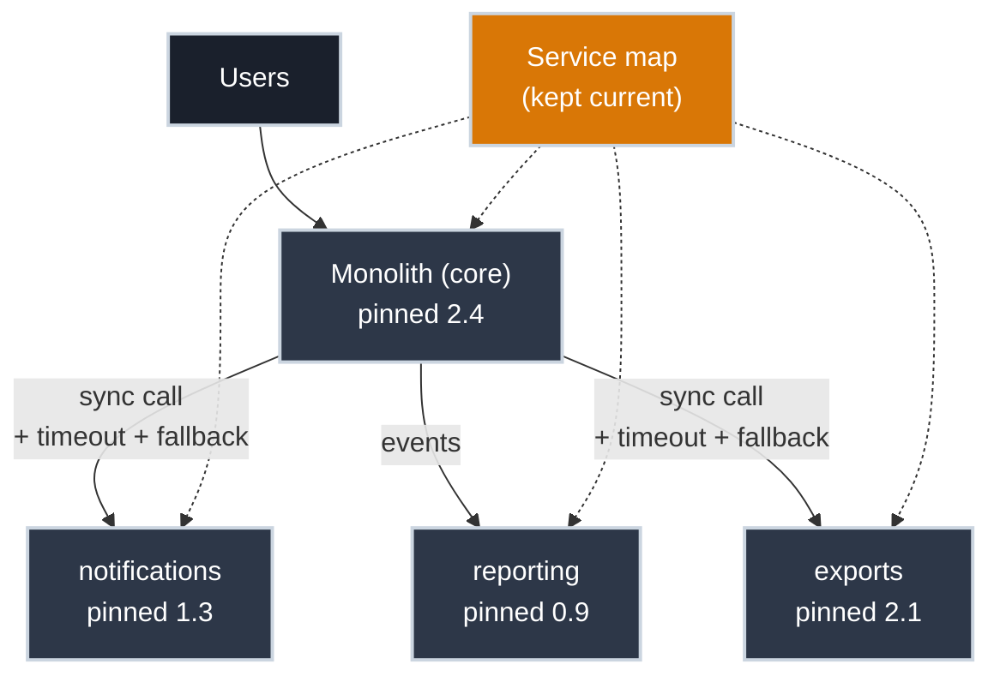

# Living With a Partial Migration

!!! tip "Part of Day One: Breaking Up a Monolith"
    Fourth and final article in [Breaking Up a Monolith](../overview.md#breaking-up-a-monolith).

Six months from now, the monolith will probably still be there. You'll have three, maybe five extracted services running next to it, each pulled out the way [the first one was](first_slice.md): a candidate that cleared the [four signals](finding_the_seams.md), given its own interface, containerized, proven at parity, cut over. There won't be a day where the last piece comes out and someone declares the migration complete.

That's not a stalled project. For almost every real monolith, "fully decomposed" isn't a state teams actually reach — it's a state some of them stop chasing once they notice the mixed state is working fine. Treating the in-between as a permanent, deliberately operated mode, rather than an embarrassing waypoint on the way to somewhere else, is what keeps it safe instead of neglected.

This is the estate you're operating now — and every arrow in it is something this article assigns an owner and a rule:

## What the Mixed State Actually Needs

### Know Where Everything Lives

The single most common failure in a long-running partial migration is nobody being sure whether a given feature lives in the monolith or in one of the extracted services anymore. A lightweight, kept-current map (even a spreadsheet or a wiki page listing each extracted service and what it owns) is enough. The cost of skipping this is a debugging session that starts in the wrong codebase entirely.

### Keep the Versioning Discipline Consistent

Knowing where a feature lives is only half the picture; knowing which version of it is actually running matters just as much. Every rule from [Sharing It With Your Team](../app/sharing_with_your_team.md) about pinned tags applies just as much to the extracted services as it did to a single containerized app; arguably more, because now there are multiple independently-versioned things that all have to be tracked, not one. A monolith on `2.4` talking to a notifications service on an unpinned `:latest` is a production incident with an unknown cause waiting to happen.

### Treat New Network Calls as New Failure Modes

Pinned versions tell you what's running; they say nothing about what happens when one service can't reach another. Every synchronous call from the monolith to an extracted slice (the pragmatic choice from [Containerizing the First Slice](first_slice.md#give-the-slice-an-interface)) is a dependency that didn't exist before. Inside a single process, one function calling another either works or throws immediately. Over a network, it can also hang, time out, or partially succeed. At minimum, every synchronous call out of the monolith needs a timeout and a defined behavior for "the service didn't answer" — that's a design decision, not a detail to leave implicit. Deeper resilience patterns (retries, circuit breakers, backoff) are Efficiency-tier territory; Day One's bar is just: don't let a downstream slice being unavailable silently hang the monolith.

### Revisit the Seams You've Already Cut

A timeout handles a slice that's temporarily unreachable. A slice that's chronically, structurally coupled to another one is a different problem, and the only way to catch it is to go back to the signals that justified the split in the first place. The four signals from [Finding the Seams](finding_the_seams.md) aren't a one-time judgment. A service extracted early, before its actual usage pattern was clear, sometimes turns out too fine-grained: coupled so tightly to one other service that the two of them change together every time anyway, which is the change-ownership signal quietly failing after the fact. That's not a mistake to hide; it's information. Merging two over-split services back together is a legitimate outcome of revisiting the signals, not an admission of failure.

### Decide When to Stop

Revisiting old seams and refusing new ones are the same discipline, pointed in opposite directions. Not every remaining piece of the monolith benefits from becoming its own service. A core that's tightly coupled internally, scales uniformly, and is owned by one team that has no interest in deploying its pieces separately can be a perfectly reasonable permanent shape — a smaller, leaner monolith, not a failure to finish the job. The four signals that justified extracting the first slice are also the test for whether extracting the *next* one is worth doing, every time, indefinitely. "We've extracted some services already" is not, on its own, a reason to extract the next one.

## Watch Out For

- **Pressure to "just finish it" on a deadline.** A rushed extraction that skips the parity check from [Containerizing the First Slice](first_slice.md#prove-parity-before-you-cut-over) to hit a date reintroduces exactly the risk the deliberate, one-slice-at-a-time approach was built to avoid.
- **Letting the service map go stale.** A map that was accurate at the three-service mark and never updated at the eight-service mark is actively misleading, worse in some ways than having no map and knowing it.
- **Extracting the next piece just because extraction is the current motion.** Re-run the four signals every time — a piece that fails them today doesn't become a good candidate just because the team has gotten good at the mechanics of extraction.

## Practice Exercises

??? question "Exercise 1: Diagnose the Silent Failure"
    The monolith calls the notifications service synchronously to trigger shipping emails. One day, the notifications service is slow (not down, just slow, taking 45 seconds to respond instead of 200ms). Customers report checkout hanging. What's missing from the integration?

    ??? tip "Solution"
        A timeout. Without one, the monolith's call to the notifications service waits indefinitely (or until some much longer default network timeout), and because the call sits in the checkout flow, checkout hangs along with it. The fix is a short, explicit timeout on the call plus a defined fallback — e.g., log the failure and let checkout complete without blocking on the confirmation email, rather than letting a downstream service's slowness become the monolith's outage.

??? question "Exercise 2: Decide Whether to Merge Back"
    Two services, extracted eight months apart, have ended up being modified in the same pull request almost every time either changes, and one frequently calls the other synchronously to get data it needs to do its own job. Using the four signals from Finding the Seams, what does this suggest?

    ??? tip "Solution"
        The change-ownership signal is now failing in practice, even if it looked fine at extraction time: they change together, which was exactly the pattern that signal was meant to catch. Combined with one needing synchronous access to the other's data (a data-ownership smell), this is a candidate for merging back into a single service rather than continuing to operate as two. Revisiting and reversing an earlier extraction is a legitimate use of the same signals that justified it in the first place — not a failure to admit to, a correction to make.

## Quick Recap

| Practice | Why It Matters |
|---|---|
| Keep a current service ownership map | Prevents debugging in the wrong codebase |
| Pin versions on every extracted service | Same discipline as [sharing a single app](../app/sharing_with_your_team.md), now multiplied |
| Timeout every synchronous call out of the monolith | A slow dependency shouldn't become the monolith's outage |
| Re-run the four signals before extracting the next piece | "We've done this before" isn't a justification on its own |
| Allow merging services back together | Revisiting a signal that now fails is a correction, not a failure |

## What's Next

That's the full Day One arc for a monolith: containerize it whole, find real seams, extract one, and operate the mixed state deliberately. Both Day One pathways converge from here: the Essentials tier — being written next — will go deeper into Docker and Podman, the runtimes underneath them, and image and registry practices that apply whether you're running one container or a dozen extracted services.

## Further Reading

### Related Articles

- [Containerizing the First Slice](first_slice.md) — the extraction process this article assumes is ongoing
- [Finding the Seams](finding_the_seams.md) — the same four signals, revisited here for services already extracted
- [Day One Overview](../overview.md) — see both Day One pathways
