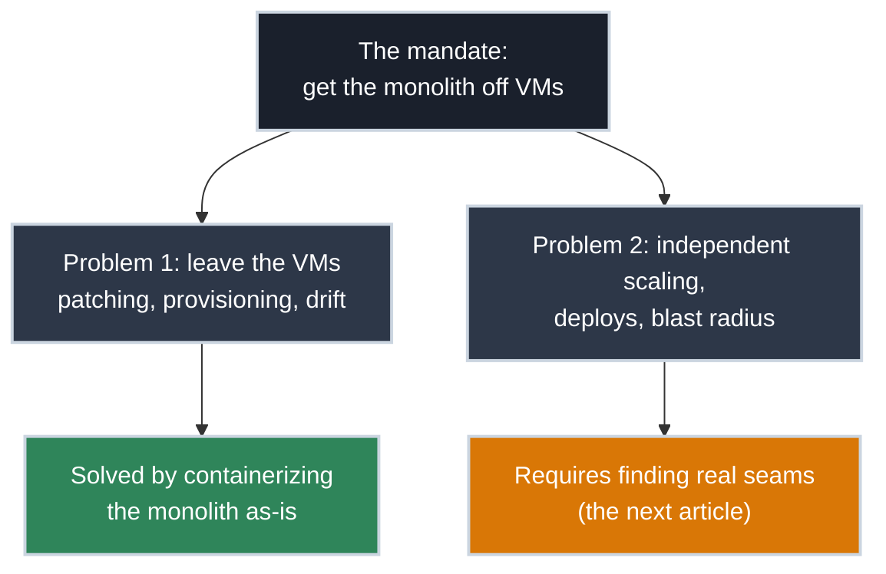

# Why the Monolith Has to Move

<!-- PATHWAY_ROADMAP:START -->
<div class="pathway-pills" markdown>
:material-map-marker-path: <span class="pathway-pills__label">Part of a deep dive:</span> [Breaking Up a Monolith](why_it_has_to_move.md){: .pathway-pill }
</div>

??? abstract ":material-map-legend: Consult the map"

    <div class="grid cards" markdown>

    -   :material-source-fork: __Breaking Up a Monolith__ — step 1 of 4

        ---

        ← *(first step)* · **you are here** · [Finding the Seams: How to Scope a Microservice](finding_the_seams.md) →

        [Start the deep dive →](why_it_has_to_move.md)

    </div>
<!-- PATHWAY_ROADMAP:END -->

!!! tip "Prerequisites"
    Read [What Is a Container, Really?](../what_is_a_container.md) first if you haven't, and make sure `docker` actually runs on your machine — [Getting Docker Running on Your Machine](../getting_docker_running.md) covers that if it doesn't yet.

Someone (a manager, a platform team, a mandate from three levels up) has said the monolith can't live on VMs anymore. Nobody handed you a redesign, just a deadline and an assumption that you know what "containerize it" means for an application that's been growing for years.

A **monolith**, in case the word's been thrown around without anyone actually defining it: one application that does everything — the web frontend, the API, the business logic, the batch jobs, all of it built and deployed as a single unit, running as one process (or several identical copies of that one process, for redundancy). There's nothing wrong with a codebase getting there; it's usually just what happens when a small team ships fast for years without stopping to draw internal boundaries. The word only becomes a problem the day someone decides it has to change.

Here's the thing that isn't obvious yet: "get off the VMs" and "break this into services" sound like the same ask, but they aren't. You can satisfy the first one without touching the second at all, and knowing that distinction now will save you from a much harder mistake later.



## What "Get Off the VMs" Actually Means

The reasons behind this mandate are rarely about the monolith's code. They're almost always about what VMs cost to operate at scale:

- **Every VM is a whole operating system to patch, monitor, and keep alive** — multiplied across dev, staging, and production, and multiplied again across however many instances run for redundancy.
- **VMs are slow to provision and slow to replace.** Standing up a new one means booting an OS; a container starts in the time it takes to start a process, which is the whole point of [what makes a container different from a VM](../what_is_a_container.md#two-ways-to-isolate-a-program).
- **"It works on this VM" is a real, recurring failure mode.** Config drift between VMs that were supposedly built the same way is a common source of production incidents that a single, versioned image structurally can't have.
- **Whatever comes next (a platform, an orchestrator, a cloud provider's managed compute) expects a container as the unit of deployment**, not a VM image.

None of these reasons require the monolith to *become* several services. They're satisfied the moment the monolith runs as a container instead of a VM.

## The Tempting Shortcut (Which Is Also a Legitimate First Step)

It's entirely possible to take the whole monolith, every module, every dependency, unchanged, and containerize it as one thing:

``` dockerfile title="Dockerfile — the whole monolith, as-is"
FROM eclipse-temurin:21-jre
WORKDIR /app
COPY monolith.jar .
CMD ["java", "-jar", "monolith.jar"]
```

This works. It builds, it runs, it satisfies "the app now runs in a container, not on a VM." (As everywhere in Day One, the `docker` commands work identically with [Podman](https://podman.io/) swapped in — see the callout in [Writing Your First Dockerfile](../app/first_dockerfile.md).) That's not cheating — it's a real, useful checkpoint, because it proves the app itself has no hidden dependency on being on a VM (a specific OS package, a file living at a fixed system path, a cron job that assumed it was the only thing on the box). Finding those dependencies *before* you also try to split the app apart means you're debugging one variable at a time instead of two.

## What This First Step Doesn't Buy You

Here's the part worth being honest about before you report "containerized" as "done": a monolith in one container is still a monolith. It still has to be redeployed in full for a one-line change anywhere in it. It still scales as a single unit; if only the reporting feature is under load, the whole application scales anyway, because there's no smaller piece to scale on its own. A bug in one module can still take down everything else running in that same process. None of the actual reasons anyone wants "microservices" (independent deploys, independent scaling, a blast radius smaller than the whole app) arrive with this step. They only arrive once there are actual seams to deploy and scale independently.

That's a separate, harder problem, and it's not one you solve by writing more Dockerfile. It's solved by figuring out where the monolith can honestly be cut, which is not "wherever the file structure suggests" — and that's the entire subject of the next article.

## Practice Exercises

??? question "Exercise 1: Sort the Justification"
    Your manager says: "We need to containerize the monolith so we can scale the checkout service independently during sales events." Is containerizing the whole monolith as one container enough to satisfy this? Why or why not?

    ??? tip "Solution"
        No. Containerizing the whole thing gets it off VMs and makes it deployable as a versioned image, but it's still one process: scaling it means scaling *everything*, checkout included, not checkout alone. Independent scaling requires checkout to exist as its own deployable unit, which means it has to be a separate seam, not just a separate container image of the same monolith. This justification specifically requires decomposition, not just containerization.

??? question "Exercise 2: Recognize a Satisfied Requirement"
    A different mandate: "Security wants everything off VMs by end of quarter because the VM patching backlog is a compliance finding." Does containerizing the whole monolith as one container satisfy this one?

    ??? tip "Solution"
        Yes. This mandate is about the operational overhead and patch surface of VMs specifically, not about how the application is internally structured. A single container running the whole monolith removes the VM entirely; whatever runs it (a platform, an orchestrator, even `docker run` on a host) handles the base OS patching as its own concern, separate from the application. This is exactly the case where the shortcut *is* the actual solution, not a stepping stone.

## Quick Recap

| Question Being Asked | Does "Containerize It As-Is" Answer It? |
|---|---|
| "Get off VMs" (patching, provisioning, drift) | Yes |
| "Standardize how we deploy" | Yes |
| "Scale piece X independently of piece Y" | No — requires actual decomposition |
| "Reduce blast radius of a bug in one module" | No — requires actual decomposition |
| "Let separate teams own and deploy separate pieces" | No — requires actual decomposition |

## What's Next

If the mandate stops at "get off VMs," you're closer to done than it feels. If it includes independent scaling, deploys, or ownership, the real work is figuring out where the monolith can actually be cut: **[Finding the Seams: How to Scope a Microservice](finding_the_seams.md)**.

## Further Reading

### Related Articles

- [What Is a Container, Really?](../what_is_a_container.md) — why a container starts fast and a VM doesn't
- [Day One Overview](../overview.md) — see both Day One pathways
