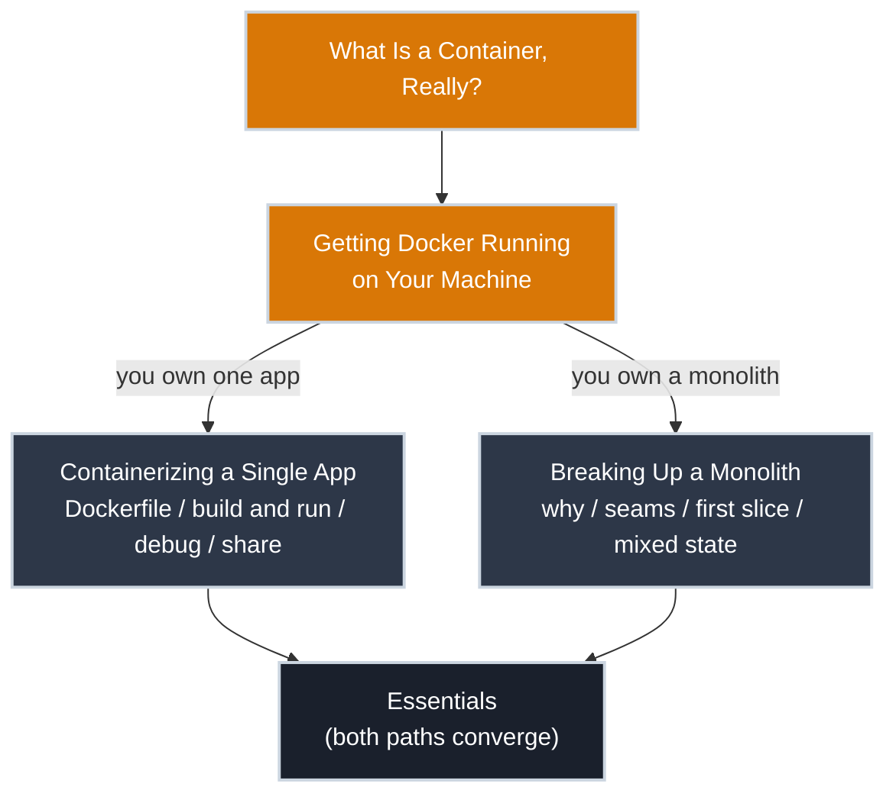

# Day One: Your App Has to Become a Container

Something changed. Maybe your manager said the word "container" in a meeting and looked at you. Maybe a platform team sent an email with a deadline and the word "VMs" in the subject line. Either way, the app is no longer allowed to just run — it has to become a container, and that's now your problem.

This section gets you there. It won't make you a Docker expert or a microservices architect by the end; that's what Essentials and the tiers beyond it are for. It will get your first container built, running, and out the door.

---

## Why You're Here

=== ":material-application: I Have One App to Containerize"

    You wrote something (a web app, an API, a script that processes data on a schedule) and now it needs to run as a container so a team, a CI pipeline, or a platform can pick it up.

    - You're packaging code you already understand; the new part is the packaging
    - The end state is one Dockerfile, one image, one container
    - **[Containerizing a Single App](#containerizing-a-single-app) covers this path.**

=== ":material-office-building: I Inherited a Monolith That Has to Leave VMs"

    You've got one big application, maybe one you wrote, maybe one you didn't, and someone's decided it can no longer live on a VM. That decision usually comes with an unspoken second one: it has to start looking like more than one thing.

    - The hard part isn't Docker syntax — it's deciding where the seams are
    - You'll containerize the whole thing before you split anything, then peel pieces off deliberately
    - **[Breaking Up a Monolith](#breaking-up-a-monolith) covers this path.**

---

## What Is a Container, Really?

Both paths start in the same place. Before you write a Dockerfile or draw a line through a monolith, you need the actual mental model: not "a container is a lightweight VM," which is the wrong analogy repeated so often it's practically folklore.

**[Start here: What Is a Container, Really?](what_is_a_container.md)**

Then, before either path gets moving, make sure the tooling itself actually works: **[Getting Docker Running on Your Machine](getting_docker_running.md)** covers Linux, macOS, and Windows — command line only, no Docker Desktop. Skip it if `docker run hello-world` already works for you.

---

## Containerizing a Single App

-   :material-numeric-1-circle: **[Writing Your First Dockerfile](app/first_dockerfile.md)**

    ---

    Turn working code into a set of instructions Docker can follow, and learn why the order of those instructions matters more than you'd guess.

-   :material-numeric-2-circle: **[Building and Running Your Image](app/build_and_run.md)**

    ---

    `docker build`, `docker run`, and the gap between "the build succeeded" and "the app actually works."

-   :material-numeric-3-circle: **[Debugging a Container That Won't Behave](app/debugging.md)**

    ---

    Your container exits immediately, or it runs but nothing connects. Here's how to find out why.

-   :material-numeric-4-circle: **[Sharing It With Your Team](app/sharing_with_your_team.md)**

    ---

    A container that only runs on your machine hasn't solved the problem yet. Get it into a registry so anyone, including a future platform, can pull it.

---

## Breaking Up a Monolith

-   :material-numeric-1-circle: **[Why the Monolith Has to Move](monolith/why_it_has_to_move.md)**

    ---

    What "get off the VMs" actually means, and why lifting the whole app into one giant container only buys you time, not the outcome anyone wants.

-   :material-numeric-2-circle: **[Finding the Seams: How to Scope a Microservice](monolith/finding_the_seams.md)**

    ---

    Not every function is a service waiting to happen. How to spot the boundaries that are actually there versus the ones you'd be inventing.

-   :material-numeric-3-circle: **[Containerizing the First Slice](monolith/first_slice.md)**

    ---

    Pick the least risky piece, cut it loose, and containerize it: proof that the approach works before you bet the rest of the monolith on it.

-   :material-numeric-4-circle: **[Living With a Partial Migration](monolith/living_with_partial_migration.md)**

    ---

    Six months from now you'll still have a monolith and a handful of services talking to it. That's not failure — here's how to run that state safely.

---

## What's Next

Read **[What Is a Container, Really?](what_is_a_container.md)** first regardless of which path you're on, then confirm `docker` actually works with **[Getting Docker Running on Your Machine](getting_docker_running.md)**, then follow the pathway that matches your situation.
