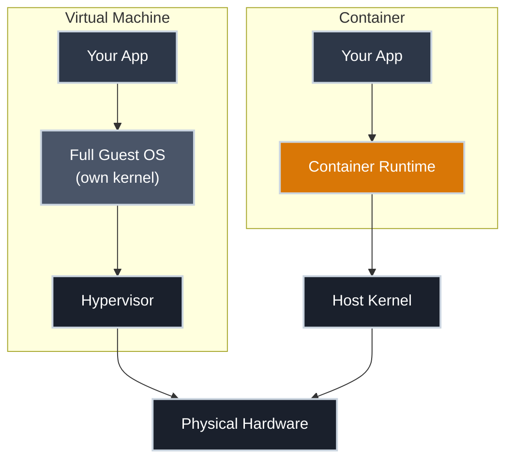
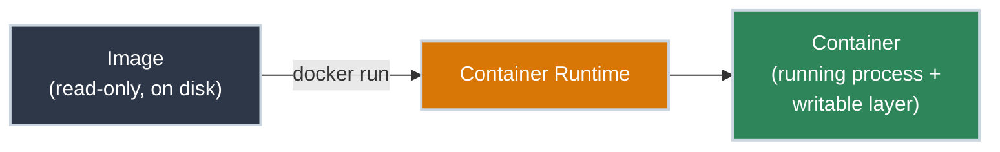

# What Is a Container, Really?

!!! tip "Part of Day One: Your App Has to Become a Container"
    This is the shared starting point for both Day One pathways. Read it before [Writing Your First Dockerfile](app/first_dockerfile.md) or [Why the Monolith Has to Move](monolith/why_it_has_to_move.md).

Somewhere along the way, someone told you a container is "like a lightweight virtual machine." It's the most common explanation there is, and it's wrong in a way that will cost you later — when you're debugging why a container sees the host's process list, or wondering why two "isolated" containers can still starve each other for memory.

A container isn't a smaller VM. It's a normal process, running on the same kernel as everything else on the box, wearing a disguise the kernel agrees to maintain.

## Two Ways to Isolate a Program

A virtual machine and a container solve the same problem from opposite directions: run this thing without letting it interfere with that thing.

A VM virtualizes the hardware. Each VM gets its own kernel, its own full operating system, and a hypervisor arbitrating access to the real hardware underneath. That's why a VM boots: it's starting an entire OS from scratch.

A container virtualizes nothing. It's a process launched directly on the host's kernel, the same kernel every other container and every other process on that machine shares. There's no guest OS to boot, which is why a container starts in the time it takes to start a process, not the time it takes to start a computer.

**What makes it "contained" isn't a boundary — it's a set of kernel features that make the process *believe* it has the machine to itself.** Two of those features do almost all the work, and you'll meet them properly in Essentials:

- One makes the process see its own private view of the filesystem, network interfaces, and process list, instead of the host's real ones
- Another limits how much CPU, memory, and I/O the process is allowed to consume, so one container can't starve the others

Day One doesn't need the mechanism-level detail, just the shape of the idea: isolation here is the kernel *agreeing to lie* to the process about what else is running, not a hardware boundary keeping it out.

!!! info "Why This Distinction Matters Later"
    Because a container shares the host kernel, a container image built for Linux needs a Linux host underneath it; there's no such thing as a "Windows container" running on a Linux kernel without a VM in between somewhere. It's also why a compromised container is a bigger deal than a compromised VM: the isolation is kernel cooperation, not a hardware wall. Essentials will pick this up in depth when its container security articles land.

## Image vs. Container: The Blueprint and the Building

The other confusion that trips people up early is using "image" and "container" as if they're the same thing. They're related the way a blueprint is related to a building.

- **Image** — a read-only, packaged bundle of everything your app needs to run: the application code, a language runtime if it needs one, system libraries, and the instructions for how to start it. Inert: it sits on disk or in a registry, doing nothing, running nothing.
- **Container** — what you get when a runtime takes that image and executes it: a running process, with a writable layer stacked on top so the running instance can create files, write logs, and hold state. None of that touches the original image underneath.

This is why you can run the same image ten times and get ten independent containers: the blueprint doesn't change no matter how many buildings you put up from it. Delete a container and the image is untouched; you can start a fresh one from the same blueprint any time. That distinction is what makes containers disposable in a way a VM never quite is: you don't patch a running container, you build a new image and replace it.

## Watch Out For

Two habits of thought carry over from VMs and cause real confusion:

- **Expecting a container to "boot."** If your container takes more than a second or two to become ready, it's almost never the kernel — it's your application doing real startup work (loading a framework, warming a cache, running migrations). There's no OS boot phase to blame it on.
- **Expecting persistence by default.** A container's writable layer disappears when the container is removed. If your app writes something you need to keep, that has to be handled deliberately — this comes up as soon as you [run your first image](app/build_and_run.md).

## Practice Exercises

??? question "Exercise 1: Spot the Bad Analogy"
    A colleague says: "Containers are basically tiny VMs; they're just faster because the cloud provider optimized them really well."

    What's wrong with this explanation, and what's the one-sentence correction?

    ??? tip "Solution"
        The error is architectural, not a matter of degree: containers aren't a faster *version* of VMs, they're a different isolation strategy entirely. A VM virtualizes hardware and runs its own kernel; a container is a process sharing the host's kernel, isolated by kernel features rather than a hypervisor. The speed difference isn't an optimization — it's the direct consequence of skipping the guest OS boot entirely.

??? question "Exercise 2: Image or Container?"
    You run `docker pull nginx` on a laptop, then run `docker run nginx` three separate times without stopping any of them. How many images exist on the laptop, and how many containers?

    ??? tip "Solution"
        One image: `docker pull` fetched a single read-only nginx image, and nothing about running it multiple times duplicates that image. Three containers: each `docker run` started a new process from that same image, each with its own writable layer, running independently of the other two.

## Quick Recap

| Concept | What It Means |
|---------|---------------|
| **Virtual machine** | Virtualizes hardware; own kernel, own OS, boots like a computer |
| **Container** | A process on the host's kernel, isolated by kernel features, starts like a process |
| **Image** | Read-only, packaged bundle of code + dependencies + start instructions |
| **Container (running)** | An image, executed — a process plus a writable layer on top |
| **Disposability** | Containers are replaced, not patched; the image is the source of truth |

## What's Next

Next up is making sure the tooling itself actually works: **[Getting Docker Running on Your Machine](getting_docker_running.md)** — skip it if `docker run hello-world` already works for you. After that, the path splits by situation: **[Writing Your First Dockerfile](app/first_dockerfile.md)** if you're containerizing a single app, or **[Why the Monolith Has to Move](monolith/why_it_has_to_move.md)** if you're breaking up something bigger.

## Further Reading

### Official Documentation

- [Open Container Initiative](https://opencontainers.org/) — the vendor-neutral specs that define what an image and a runtime actually are
- [Docker Docs: What Is a Container?](https://www.docker.com/resources/what-container/) — Docker's own framing of the concept

### Related Articles

- [Day One Overview](overview.md) — see both Day One pathways
