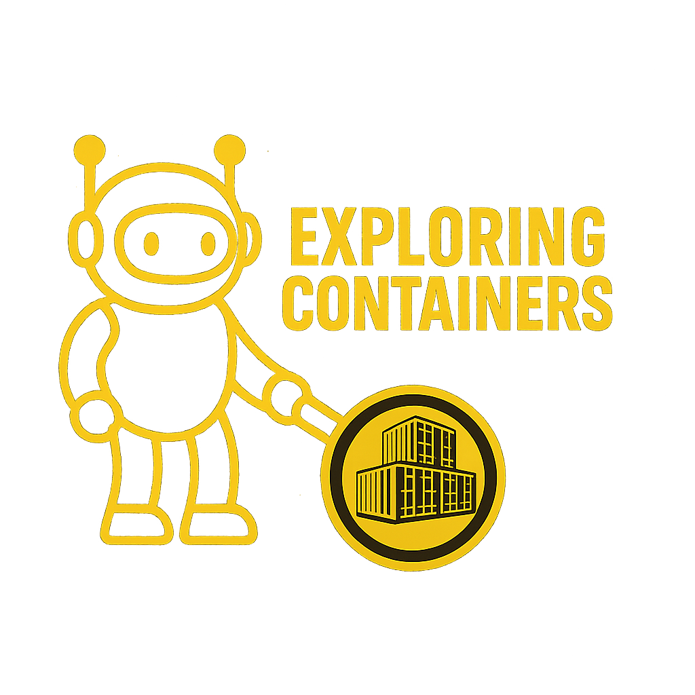

# Welcome to Exploring Containers

A container isn't a tiny virtual machine, and knowing how to run `docker build` doesn't mean you know what's actually isolating your process from everything else on the box. This site covers containerization as its own topic — not a Kubernetes prerequisite, not a Docker cheat sheet, but the full stack from kernel primitives to production supply-chain security.

## Who Is This For?

Start where you are. The tiers build in order, but jump to whatever you need.

-   :material-account: **Day One — Your App Has to Become a Container**

    ---

    Either you're shipping a single app — a web service, an API, an ETL job — and it has to be containerized before anyone else can run it. Or you've inherited a monolith and someone's told you it's leaving the VMs, which means learning to think in services for the first time.

    **Day One covers both paths**, from what a container actually is to your first working image.

    [:octicons-arrow-right-16: Start with Day One](day_one/overview.md)

-   :material-cube-outline: **Essentials — Running Containers with Intent**

    ---

    You're building images, not just running someone else's. You want to know Docker and Podman well enough to reach for the right one, and understand what a runtime actually does.

    **Essentials covers the tools and the fundamentals underneath them.**

    *Coming soon*

-   :material-lightning-bolt: **Efficiency — Beyond the Single Container**

    ---

    Multi-container apps, registries you host yourself, and the runtime layer Kubernetes depends on. This is where "it works on my machine" turns into a real deployment story.

    **Efficiency covers composition, distribution, and the CRI.**

    *Coming soon*

-   :material-trophy: **Mastery — Production Containers**

    ---

    Supply chain trust, image signing, SBOMs, and choosing a runtime for workloads that need real isolation guarantees.

    **Mastery is for the platform engineers who own this in production.**

    *Coming soon*

## Why a Site Just for Containers?

Container runtimes (containerd, CRI-O, runc), the OCI image and runtime specs, Docker and Podman as tools, and the security discipline around all of it are each deep enough to stand on their own — Kubernetes just consumes containers as its unit of deployment, it doesn't teach what one is. Containers sit in the middle of the stack: built out of the Linux kernel features covered on [Exploring Linux](https://linux.bradpenney.io), and consumed as the unit of deployment by the orchestration covered on [Exploring Kubernetes](https://k8s.bradpenney.io). This site owns that middle layer, so every other site can assume you already know what a container is.

!!! info "Where This Fits"
    If you're looking for how Kubernetes uses containers — kubelet, the CRI, Pods, `initContainers` — that's on [Exploring Kubernetes](https://k8s.bradpenney.io). This site owns the container itself: the runtime, the image, the tool, the isolation.
